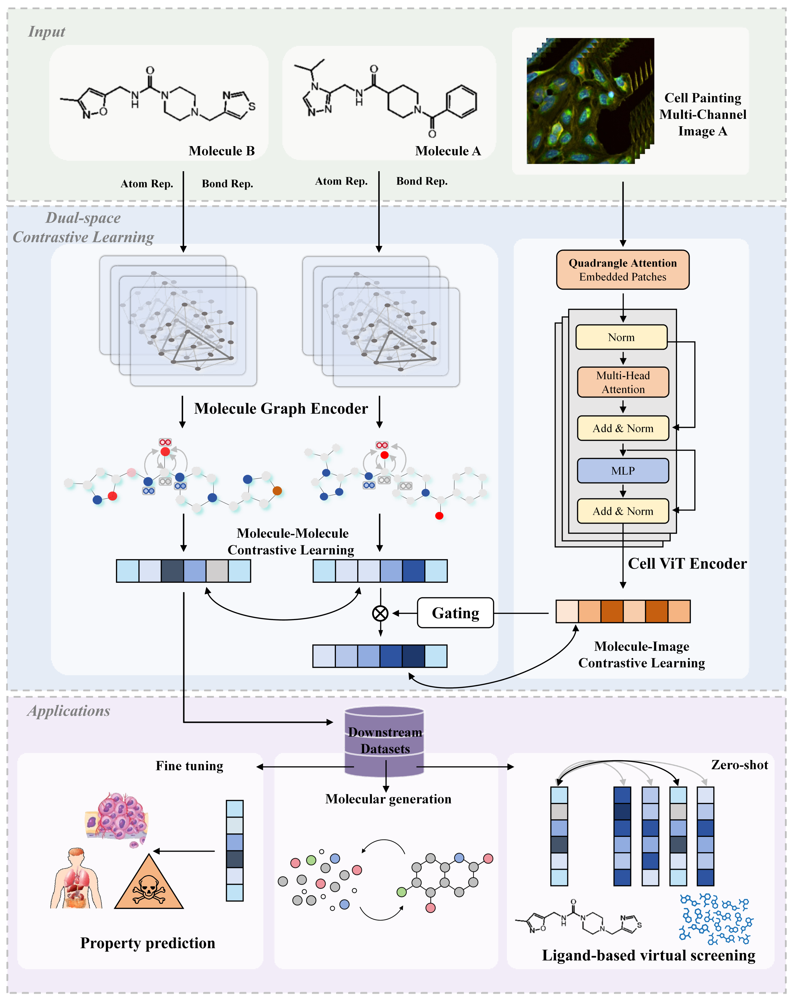

<h1 align="center">  PhenoModel  </h1>
<h3 align="center">  A Dual-Space Contrastive Learning Framework-based Phenotypic Screening Method by Linking Chemical Perturbations to Cellular Morphology </h3>
<p align="center">
   📃 <a href="https://www.biorxiv.org/content/10.1101/2024.10.23.619752v1" target="_blank">Paper</a> ·  🤗 <a href="https://huggingface.co/Sean-Wong/PhenoScreen" target="_blank">Model</a> ·  📕 <a href="https://zenodo.org/records/13943032" target="_blank">Data</a><br>
</p>

<p align="center">
  
</p>

## Overview 📘
**PhenoModel** is a cutting-edge molecular representation foundation model that integrates cell phenotype data to enhance the characterization of molecules. By leveraging the rich information embedded in cell images, PhenoModel significantly improves performance in various drug discovery tasks, particularly in virtual screening. Based on PhenoModel, we developed an active compound screening pipeline called **PhenoScreen** to further screen other molecules with similar activities but novel scaffolds according to the known active compounds. For simple use, you can use PhenoScreen on a [webserver](https://bailab.siais.shanghaitech.edu.cn/services/phenomodel).

## Key Features ✨

- **Enhanced Molecular Representation**: Combines molecular structure data with cell phenotype information to create a more comprehensive representation of molecules.
- **Superior Performance in Virtual Screening**: Demonstrates excellent performance in identifying active molecules across various targets, outperforming traditional methods.
- **Flexible Application**: Applicable to a wide range of tasks including molecular property prediction and phenotype-based drug discovery.

## How It Works ⚙️

1. **Molecular Feature Extraction**: Uses a four-layer Weisfeiler-Lehman Network (WLN) pre-trained with GeminiMol weights to encode molecular structures into high-dimensional embeddings.
2. **Cell Image Feature Extraction**: Applies a ViT model based on QFormer to encode cell images, incorporating a novel Quadrangle Attention mechanism to handle varying object sizes, shapes, and orientations.
3. **Dual-space Joint Training**: Simultaneously trains molecular and image encoders using contrastive learning to align features and enhance model performance.
4. **Feature Fusion**: Integrates molecular and cell image features to create a unified representation that captures both structural and activity-related information.

## Performance 📈 

- **Phenotype-based Virtual Screening**: Demonstrates excellent capability in multi-target activity tests (NCI cell line bioassays benchmark), showcasing the power of integrating cell phenotype data.
- **Target-based Virtual Screening**: Achieves superior performance in DUD-E and LIT-PCBA Benchmarks compared to traditional models.
- **Property Prediction**: Competitive performance in predicting absorption, distribution, metabolism, excretion, and toxicity properties (ADMET), comparable to large-scale pre-trained models.

## News 🔔 
* 2025-01, **PhenoModel** has been released. PhenoScreen, as a virtual screening pipeline, has been merged as part of PhenoModel.
* 2024-10, **PhenoScreen** has been released.


## Getting Started 🚀

To use PhenoModel and PhenoScreen, follow these steps:

1. **Clone the Repository**:
   ```bash
   conda create -n PhenoModel python=3.8.13
   conda activate PhenoModel

   git clone https://github.com/Shihang-Wang-58/PhenoScreen.git
   cd PhenoScreen
   ```
2. **Install Dependencies**:
   ```bash
   pip install torch==1.13.1+cu116 torchvision==0.14.1+cu116 \
       --extra-index-url https://download.pytorch.org/whl/cu116
   pip install dgl==1.1.1+cu116 -f https://data.dgl.ai/wheels/cu116/repo.html
   pip install dglgo==0.0.2 -f https://data.dgl.ai/wheels-test/repo.html
   pip install dgllife==0.3.2

   pip install rdkit

   conda env update -n PhenoModel -f PhenoModel.yaml
   ```
3. **Run the Model**:

   For virtual screening, running:
   ```
   export task_name="DUDE" or "LIT-PCBA"
   export geminimol_path="./models/GeminiMol"
   python ./phenoscreen/benchmark_vs.py "./models/v1" "./data/benchmark.json" "${task_name}" "${geminimol_path}"
   ```
   For property prediction, running:
   ```
   export task_name="ADMET-C", "ADMET-R" or ...
   export geminimol_path="./models/GeminiMol"
   python ./phenoscreen/benchmark.py "./models/v1" "./data/benchmark.json" "${task_name}"  "${geminimol_path}"
   ```
   For drug similarity search, you need to define a pharmacological profile file. For example, you can create a CSV file called "profile.csv" in the following format: where the SMILES column is the reference molecule you provided, and the Label column is the weight you assigned.

   ``` 
   SMILES,Label
   C=CC(=O)N[C@@H]1CN(c2nc(Nc3cn(C)nc3OC)c3ncn(C)c3n2)C[C@H]1F,1.0
   C=CC(=O)Nc1cccc(Nc2nc(Nc3ccc(N4CCN(C(C)=O)CC4)cc3OC)ncc2C(F)(F)F)c1,1.0
   COC(=O)CCC/N=C1\SCCN1Cc1ccccc1,0.4
   C=C(C)[C@@H]1C[C@@H](CC2(CC=C(C)C)C(=O)C(C(CC(=O)O)c3ccccc3)=C3O[C@@H](C)[C@@H](C)C(=O)C3=C2O)C1(C)C,-0.8
   C/C(=C\c1ncccc1C)[C@@H]1C[C@@H]2O[C@]2(C)CCC[C@H](C)[C@H](O)[C@@H](C)C(=O)C(C)(C)[C@@H](O)CC(=O)O1,-0.5
   ```
   Then, you can running the following script:
   ```
   export job_name="Virtual_Screening"
   export profile_set="profile.csv" # SMILES (same to compound library) and Label (requried)
   export compound_library="./compound_library/specs.csv" 
   export smiles_column="SMILES" # Specify the column name in the compound_library
   export weight_column="Label" # weights for profiles
   export keep_top=3000
   export probe_cluster="Yes"
   python -u ./phenoscreen/PharmProfiler.py "./models/v1" "${job_name}" "${smiles_column}" "${compound_library}" "${profile_set}:${weight_column}" "${keep_top}" "${probe_cluster}"
   ```
   If you find this process difficult for you, you can also upload a profile file directly on our online website for similarity screening.

## Data 📂
All training and downstream tasks datasets could be easily downloaded at https://zenodo.org/records/13943032, or https://huggingface.co/Sean-Wong/PhenoScreen, unzip it to the corresponding folder. The cpg0012 dataset originally consists of 919,265 cellular images collected from 30,616 molecular intervention and you can access it at http://gigadb.org/dataset/100351.


## Online Server 🌐 

We deployed a pre-trained model on a dedicated server, which is publicly available at https://bailab.siais.shanghaitech.edu.cn/PhenoModel, to make it easy for biomedical researcher users to utilize the virtual screening pipeline of PhenoModel (PhenoScreen) in their research activity. 

Users can upload their SMILES or csv files to the server, and then they can quickly obtain the screened results.

## Citation 🔗 
Papers involving PhenoModel have been submitted to an academic journal. If you find this repository useful in your research, please consider citing the preprint:<br/>
**PhenoScreen: A Dual-Space Contrastive Learning Framework-based Phenotypic Screening Method by Linking Chemical Perturbations to Cellular Morphology**<br/>
Shihang Wang, Qilei Han, Weichen Qin, Lin Wang, Junhong Yuan, Yiqun Zhao, Pengxuan Ren, Yunze Zhang, Yilin Tang, Ruifeng Li, Zongquan Li, Wenchao Zhang, Shenghua Gao, Fang Bai<br/>
*bioRxiv*, 2024.10.23.619752; doi: https://doi.org/10.1101/2024.10.23.619752

Also, you can access our related work called GeminiMol:

**Conformational Space Profile Enhances Generic Molecular Representation Learning**     
Lin Wang, Shihang Wang, Hao Yang, Shiwei Li, Xinyu Wang, Yongqi Zhou, Siyuan Tian, Lu Liu, Fang Bai    
*Advanced Science*, 2024; doi: 10.1002/advs.202403998

## Get in Touch 💌

We welcome community contributions of extension tools based on the PhenoScreen model, etc. If you have any questions, please feel free to contact Shihang Wang (Email: wangshh12022@shanghaitech.edu.cn) or Lin Wang (Email: wanglin3@shanghaitech.edu.cn). 

Pull requests are highly welcomed!

## License 📜
PhenoModel and PhenoScreen are released under the Academic Free Licence, which permits academic use, modification and distribution free of charge. PhenoScreen can be utilized in academic publications, open-source software projects, and open-source competitions (e.g. Kaggle competitions under the MIT Open Source license).

PhenoModel and PhenoScreen prohibit unauthorised commercial use, including commercial training and as part of a paid computational platform, which intended to prevent speculators from exploiting informational asymmetry for profit. Communication and authorization with our [our supervisor](baifang@shanghaitech.edu.cn) is permitted for its application in pipeline development and research activities within pharmaceutical R&D.

## Acknowledgments 🤝
We are grateful for the support from HPC Platform of ShanghaiTech University.

Thank you all for your attention to this work.


